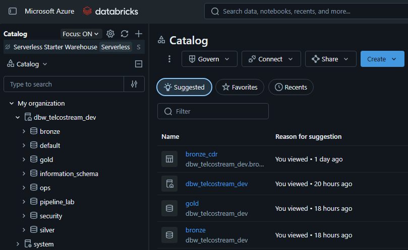
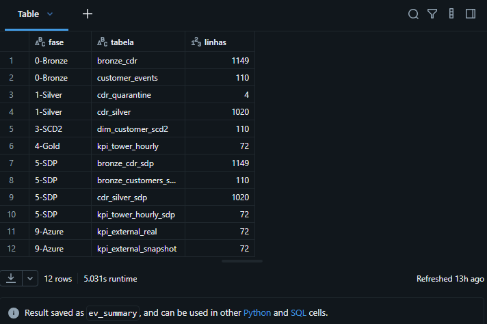
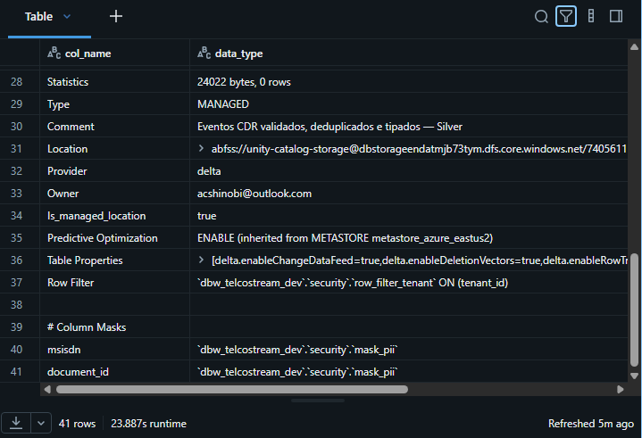
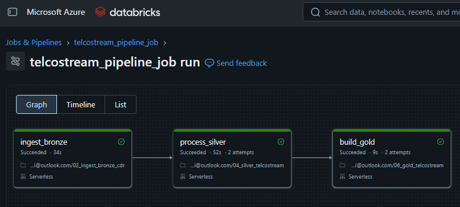
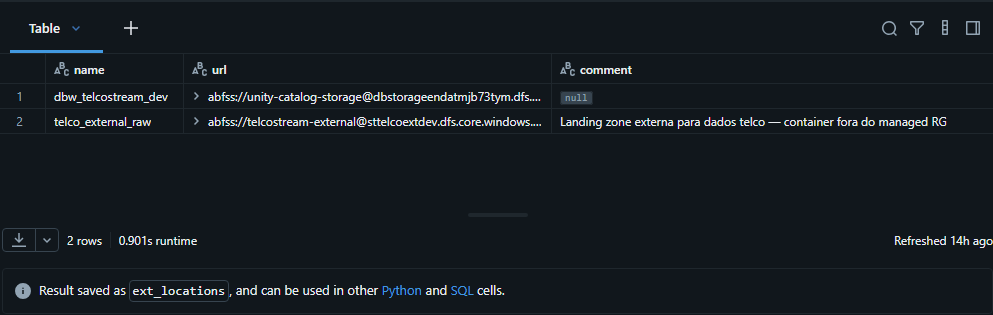

# TelcoStream Lakehouse

Projeto de referência para o exame **DP-750 (Microsoft Certified: Azure Databricks Data Engineer Associate)**.  
Implementa um pipeline Medalhão completo (Bronze → Silver → Gold) com Unity Catalog no Azure Databricks, orientado à ingestão de **Call Detail Records (CDR)** e dados de consumo móvel para **monitorização operacional da rede**, **deteção de anomalias**, e **suporte a análises de retenção/churn**, com governança rigorosa de PII.

## Arquitetura

```
ADLS Gen2 (Volumes UC)
    │
    ├── Auto Loader (cloudFiles) ────► bronze.bronze_cdr          (1.149 linhas)
    └── COPY INTO               ────► bronze.customer_events     (110 linhas)
                                          │
                    MERGE (CTE inline, idempotente)
                                          │
                    ├──► silver.cdr_silver          (1.020 válidos)
                    ├──► silver.cdr_quarantine      (4 inválidos)
                    └──► silver.dim_customer_scd2   (110 versões, SCD Tipo 2)
                                          │
                    INSERT OVERWRITE PARTITION BY region
                                          │
                         ► gold.kpi_tower_hourly      (72 grupos hora/antena)
```

## Cenário de Mercado

Uma operadora de telecomunicações necessita de ingerir registos de chamadas (**Call Detail Records - CDR**) e dados de consumo de dados móveis para monitorizar anomalias de rede, mitigar o abandono de clientes (**churn**) e expor métricas operacionais para as equipas de analítica, garantindo conformidade rigorosa com a privacidade de dados (**PII**).

Neste projeto, a camada Gold implementada está focada em **KPIs operacionais por antena/hora**, permitindo observabilidade da rede e identificação de degradação de serviço. O caso de uso de churn fica **habilitado pela Silver e pela dimensão histórica SCD2**, mas não é ainda materializado numa Gold específica de risco de churn.

### 📸 Evidência no Azure Databricks (Unity Catalog)



Print real do Catalog Explorer no Azure Databricks, evidenciando o catálogo `dbw_telcostream_dev` e a organização dos schemas `bronze`, `silver`, `gold`, `ops`, `pipeline_lab` e `security` no Unity Catalog. Esta visão reforça a estrutura Medalhão do projeto e a separação entre ingestão, transformação, analytics, governança e artefatos declarativos.

### 📊 Contagens end-to-end (12 tabelas, todas as fases)



Query SQL que consolida contagens de todas as 12 tabelas do projeto em uma única visualização. Manifesto de reconciliação: **1.149 Bronze = 1.020 Silver + 4 Quarentena + 125 Duplicatas**.

### 🔒 Governança ativa — Column Mask + Row Filter



`DESCRIBE EXTENDED` em `silver.cdr_silver` confirmando `row_filter_tenant` e `mask_pii` aplicados diretamente no metastore do Unity Catalog — não apenas em lógica de aplicação.

### ⚙️ Lakeflow Job — 3 tarefas em sequência



Job `telcostream_pipeline_job` com dependências serializadas: `ingest_bronze` → `process_silver` → `build_gold`. Run com todas as 3 tarefas concluídas com sucesso.

### 🌐 External Locations no Unity Catalog



`SHOW EXTERNAL LOCATIONS` evidenciando as 2 external locations registradas: o storage gerenciado pelo workspace e `telco_external_raw` apontando para o storage externo criado fora do managed resource group.

---

## Estrutura do Repositório

```
telcostream-lakehouse/
├── databricks.yml                  # Declarative Automation Bundle (DAB)
├── governance/
│   └── 08_governance.sql            # Column masks, row filter, GRANTs
├── azure/
│   └── 09_azure_extensions.py       # External table + secret scope
├── evidencias/
│   └── 00_ambiente.md               # Workspace, contagens, infra
└── docs/
    └── decisoes.md                  # Decisões técnicas documentadas
```

## Fases Implementadas

| Fase | Descrição | Status |
|---|---|---|
| 0 | Fundação: catálogo, schemas, volumes | ✅ |
| 1 | Silver: MERGE idempotente + quarentena | ✅ |
| 2 | Replay lote 02: Auto Loader + COPY INTO | ✅ |
| 3 | SCD2: dim_customer_scd2 | ✅ |
| 4 | Gold: KPIs particionados por region | ✅ |
| 5 | Pipeline Declarativo (SDP): `telcostream_sdp` | ✅ |
| 6 | Lakeflow Job: 3 tarefas, run 695010521785213 SUCCESS | ✅ |
| 7 | Git folder + Declarative Automation Bundle | ✅ |
| 8 | Governança: column mask, row filter, GRANTs | ✅ |
| 9 | Azure Extensions: external table, secret scope, external storage real | ✅ |

## Recursos no Workspace

| Recurso | ID |
|---|---|
| Catálogo UC | `dbw_telcostream_dev` |
| Pipeline SDP | `d9fc5ce0-205f-4ba6-b008-23402cca1568` |
| Job (manual) | `699226207030057` |
| Job (bundle) | `742363202625953` |
| Workspace | `<WORKSPACE_HOST>` |

## Como Reproduzir

```bash
# Clonar e implantar via bundle
git clone https://github.com/Sandoque/telcostream-lakehouse
cd telcostream-lakehouse
databricks bundle validate --target dev
databricks bundle deploy   --target dev
```

Ver `evidencias/00_ambiente.md` para detalhes do ambiente e contagens.  
Ver `docs/decisoes.md` para decisões técnicas justificadas.  
Ver `docs/relatorio_tecnico_telcostream_dp750.md` para o relatório técnico consolidado.